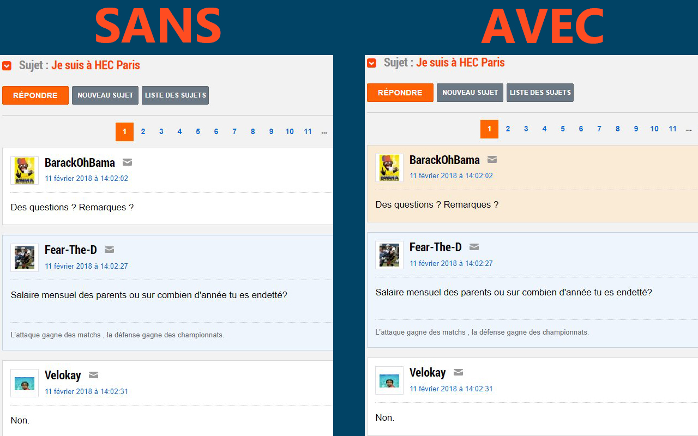

# JVC author finder

**JVC author finder** est une extension de navigateur. Elle permet de mettre en évidence l'auteur d'un topic de forum jeuxvideo.com

Elle ne s'active donc seulement sur les différents forums du site.

Elle permet de mettre en évidence l'auteur d'un topic en modifiant la couleur d'arrière plan de ses posts.
La couleur d'arrière plan est modifiable dans les options.

Cette extension est diponible sur les navigateurs Chrome (Chromium) et Firefox

JE N'AI AUCUN LIEN AVEC L'EQUIPE DE JEUXVIDEO.COM, cette extension n'est distribuée que par pur plaisir de développement et de partage

## Google Chrome

[Cliquez ici](https://chrome.google.com/webstore/detail/jvc-author-finder/hoeijbomnhcjbndempnkgfgifdgpjfaj) pour installer l'extension

[Code source](/chrome/src) de la version Chrome

## Firefox

[Cliquez ici](https://addons.mozilla.org/fr/firefox/addon/jvc-author-finder/) pour installer l'extension

[Code source](/firefox/src) de la version Firefox

## Screenshots

